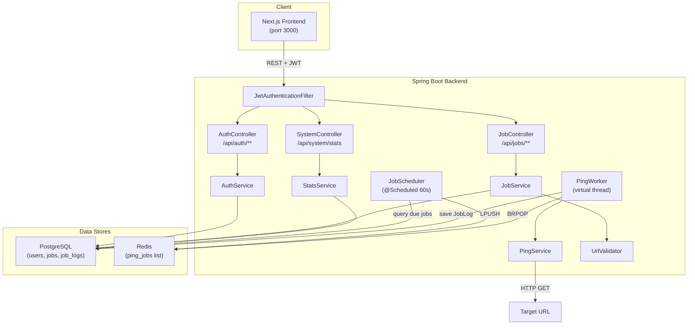
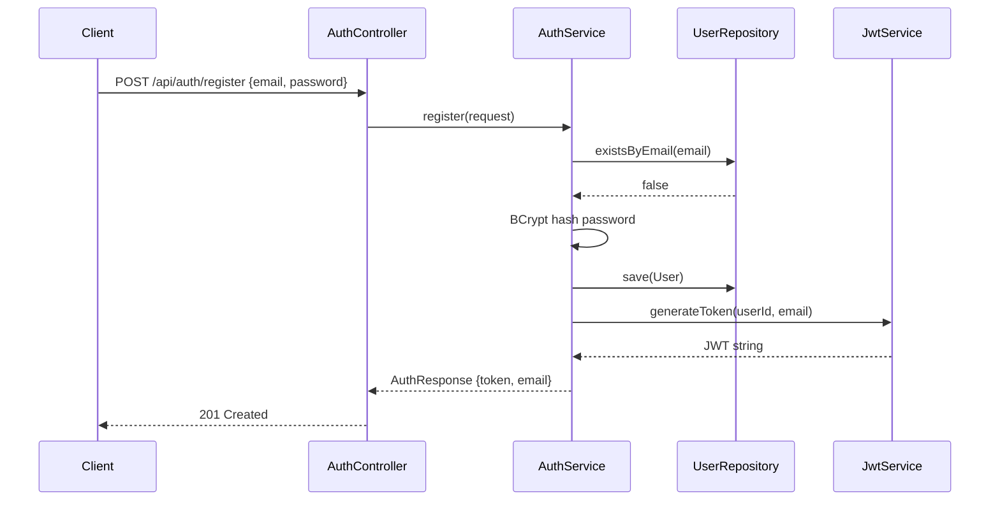
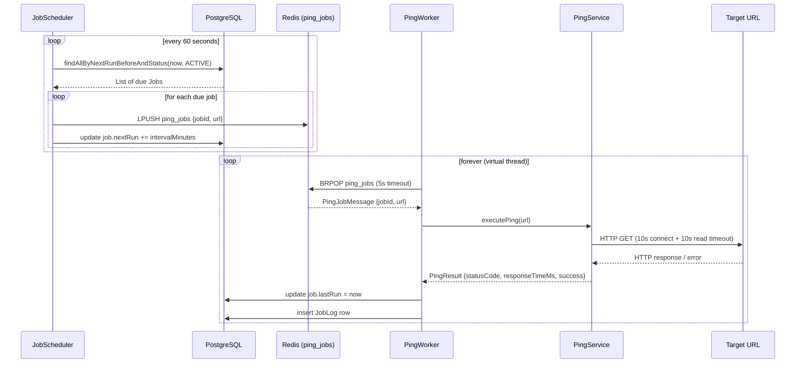
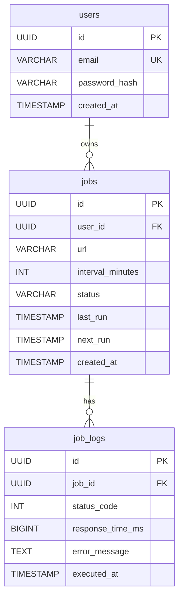

# CronPing — Technical Interview Preparation Guide

---

## 1. First Principles — What & Why

### What Problem Does It Solve?

CronPing is a **cron-based uptime monitoring and alerting service**. Users register accounts, submit URLs with a ping interval (1–1440 minutes), and the system periodically sends HTTP GET requests to those URLs, recording status codes, latency, and errors.

**In one sentence:** *"CronPing is like a self-hosted UptimeRobot — you give it a URL and an interval, and it pings it on schedule, logs every result, and shows you latency/success-rate dashboards."*

### Why Does the Problem Matter?

- **Revenue loss** — a 1-hour outage of an e-commerce site can cost thousands of dollars; early detection is critical.
- **SLA compliance** — B2B services must prove uptime percentages; monitoring provides the data.
- **Operational awareness** — teams need real-time signals (latency spikes, DNS failures, connection refused) to diagnose issues before users report them.

### Why Existing Tools Aren't Enough

| Concern | Why build your own? |
|---|---|
| **Cost** | UptimeRobot / Pingdom charge per-monitor fees that add up at scale |
| **Customizability** | SaaS tools offer fixed check intervals, limited alerting integrations |
| **Data ownership** | Health data stays in your own PostgreSQL; no vendor lock-in |
| **Learning value** | Demonstrates scheduler design, queue-based async processing, JWT auth, SSRF prevention — all production-relevant skills |

---

## 2. System Architecture

### High-Level Component Diagram



### Package Map

| Package | Responsibility |
|---|---|
| `controller` | HTTP endpoints — thin, delegates to services |
| `service` | Business logic: auth, job CRUD, pinging, stats, URL validation |
| `entity` | JPA entities: [User](file:///c:/CronPing/src/main/java/com/cronping/entity/User.java#26-53), [Job](file:///c:/CronPing/src/main/java/com/cronping/entity/Job.java#31-75), [JobLog](file:///c:/CronPing/src/main/java/com/cronping/entity/JobLog.java#28-62), `JobStatus` |
| `repository` | Spring Data JPA interfaces — derived queries + custom JPQL |
| [security](file:///c:/CronPing/src/main/java/com/cronping/security/SecurityConfig.java#37-64) | [SecurityConfig](file:///c:/CronPing/src/main/java/com/cronping/security/SecurityConfig.java#30-93), [JwtService](file:///c:/CronPing/src/main/java/com/cronping/security/JwtService.java#24-98), [JwtAuthenticationFilter](file:///c:/CronPing/src/main/java/com/cronping/security/JwtAuthenticationFilter.java#33-74) |
| `config` | [RedisConfig](file:///c:/CronPing/src/main/java/com/cronping/config/RedisConfig.java#17-46), [PingJobQueue](file:///c:/CronPing/src/main/java/com/cronping/config/PingJobQueue.java#23-69), [RestTemplateConfig](file:///c:/CronPing/src/main/java/com/cronping/config/RestTemplateConfig.java#16-27) |
| `scheduler` | [JobScheduler](file:///c:/CronPing/src/main/java/com/cronping/scheduler/JobScheduler.java#27-72) — periodic dispatcher |
| `worker` | [PingWorker](file:///c:/CronPing/src/main/java/com/cronping/worker/PingWorker.java#29-115) — queue consumer & HTTP executor |
| `dto` | Request/response objects (DTOs) with Jakarta Bean Validation |

---

## 3. Key Components & Responsibilities

### Authentication Flow



- **Password hashing** — BCrypt with default strength (10 rounds); never stores plaintext.
- **Immediate token** — after registration, a JWT is returned so the client can authenticate immediately without a separate login call.
- **JWT structure** — `sub` = userId (UUID), custom claim `email`, `iat`, `exp`.
- **Stateless sessions** — `SessionCreationPolicy.STATELESS`; no `JSESSIONID` cookie.

### Scheduler → Queue → Worker Pipeline

This is the **heart of the system** and the most architecturally significant component.



**Why separate scheduler and worker?**
- **Separation of concerns** — the scheduler only decides *when*; the worker decides *how*.
- **Scalability** — you can run multiple worker instances consuming from the same Redis queue without changing the scheduler.
- **Resilience** — if a ping takes 10 seconds, the scheduler isn't blocked; it just queries and enqueues.

### SSRF Protection — [UrlValidator](file:///c:/CronPing/src/main/java/com/cronping/service/UrlValidator.java#16-87)

The [UrlValidator](file:///c:/CronPing/src/main/java/com/cronping/service/UrlValidator.java#16-87) runs **before** any job is created. It blocks:

| Threat | How Blocked |
|---|---|
| `localhost` / `127.0.0.1` / `[::1]` | String & InetAddress checks |
| Private networks (`10.x`, `172.16-31.x`, `192.168.x`) | `isSiteLocalAddress()` |
| Link-local (`169.254.x.x`) — AWS metadata | `isLinkLocalAddress()` |
| Cloud metadata (`metadata.google.internal`) | Explicit string block |
| Multicast addresses | `isMulticastAddress()` |
| Non-HTTP schemes (`ftp://`, `file://`) | Scheme whitelist |

> [!IMPORTANT]
> This prevents the backend from being used as a proxy to probe internal infrastructure — a critical security concern in any system that makes outbound HTTP requests on behalf of users.

---

## 4. Data Flow — Step by Step

### Creating a Job

1. **Client** sends `POST /api/jobs` with `Authorization: Bearer <jwt>` and body `{url, intervalMinutes}`.
2. **[JwtAuthenticationFilter](file:///c:/CronPing/src/main/java/com/cronping/security/JwtAuthenticationFilter.java#33-74)** extracts token → validates → sets `SecurityContextHolder` with userId as principal.
3. **`JobController.createJob()`** extracts `UUID userId` from `authentication.getPrincipal()`.
4. **`JobService.createJob()`**:
   - Loads the [User](file:///c:/CronPing/src/main/java/com/cronping/entity/User.java#26-53) entity (required for the FK).
   - Calls `UrlValidator.validate(url)` — scheme check, host check, DNS resolution, blocked-address check.
   - Builds a [Job](file:///c:/CronPing/src/main/java/com/cronping/entity/Job.java#31-75) entity with `status = ACTIVE`, `nextRun = now + intervalMinutes`.
   - Persists to PostgreSQL.
   - Returns [JobResponse](file:///c:/CronPing/src/main/java/com/cronping/dto/JobResponse.java#18-32) DTO.
5. **Next scheduler tick** (≤60 seconds later) picks up the job and enqueues it.

### Executing a Ping

1. **`JobScheduler.scheduleDueJobs()`** runs every 60s via `@Scheduled(fixedRate = 60_000)`.
2. Queries [findAllByNextRunBeforeAndStatus(Instant.now(), ACTIVE)](file:///c:/CronPing/src/main/java/com/cronping/repository/JobRepository.java#21-27).
3. For each due job: `LPUSH` a `PingJobMessage {jobId, url}` onto Redis list `ping_jobs`, then advances `nextRun`.
4. **`PingWorker.pollLoop()`** (running in a Java 21 virtual thread) does `BRPOP ping_jobs 5` — blocking pop with 5-second timeout.
5. On receiving a message, calls `PingService.executePing(url)`:
   - Builds `HttpRequest` with `java.net.http.HttpClient`.
   - `BodyHandlers.discarding()` — ignores response body (only cares about status + latency).
   - Measures `System.currentTimeMillis()` delta for latency.
   - Catches `HttpTimeoutException`, `UnknownHostException`, `ConnectException`.
6. Worker updates `job.lastRun = Instant.now()` and inserts a [JobLog](file:///c:/CronPing/src/main/java/com/cronping/entity/JobLog.java#28-62) row.

---

## 5. Technologies — Why Each Was Chosen

| Technology | Role | Why This Choice | Alternative & Trade-off |
|---|---|---|---|
| **Java 21** | Language | Virtual threads (Project Loom), modern HTTP client, strong typing | Go: simpler concurrency but smaller library ecosystem |
| **Spring Boot 3.4** | Web framework | Mature DI, security, JPA integration, scheduling | Quarkus: faster startup but Spring has larger community |
| **PostgreSQL** | Primary store | Relational integrity, JSONB support, mature | MySQL: viable, but PG better for UUID PKs and advanced queries |
| **Redis** | Job queue | Sub-millisecond LPUSH/BRPOP, simple list-based FIFO | RabbitMQ: richer features (acks, DLQ) but heavier operational overhead |
| **Spring Data JPA / Hibernate** | ORM | Derived queries, transaction management | jOOQ: more SQL control but more boilerplate |
| **jjwt 0.12** | JWT library | Clean builder API, actively maintained | Spring's built-in OAuth2 Resource Server: more opinionated |
| **BCrypt** | Password hashing | Adaptive cost factor, industry standard | Argon2: newer/stronger but BCrypt is battle-tested |
| **Lombok** | Boilerplate reduction | `@Builder`, `@Getter`, `@Slf4j` | Java Records: immutable but can't be JPA entities easily |
| **Next.js** | Frontend | SSR, file-based routing, TypeScript support | Vite + React: lighter but no SSR out of the box |
| **HikariCP** | Connection pool | Default in Spring Boot, fastest JDBC pool | Standalone config, already included |
| **Virtual Threads** | Worker threading | Lightweight, no OS thread per blocking I/O call | Platform threads: heavier, limited scalability |

### Key Design Trade-offs Worth Discussing

1. **Redis list vs. dedicated message broker** — Redis lists sacrifice message acknowledgment and dead-letter queues for simplicity. If a worker crashes mid-processing, the message is lost.

2. **Polling scheduler vs. per-job cron** — A single `@Scheduled(fixedRate=60_000)` polls all due jobs, which is simpler than creating a Quartz `CronTrigger` per job but adds up to 60s of scheduling latency.

3. **Soft delete vs. hard delete** — `JobStatus.DELETED` keeps data for audit but means queries must always filter by status.

4. **Single worker thread vs. thread pool** — Currently one virtual thread. Simple but limits throughput when many jobs are due simultaneously.

---

## 6. Execution Lifecycle — Complete Request Journey

### When a User Registers

```
HTTP POST /api/auth/register
        │
        ▼
  SecurityFilterChain
  ├─ CSRF disabled (JWT-based)
  ├─ /api/auth/** → permitAll() ✓
  └─ JwtAuthenticationFilter → no token needed
        │
        ▼
  AuthController.register()
  ├─ @Valid → checks @Email, @NotBlank, @Size(8..128)
  └─ authService.register()
      ├─ existsByEmail() → duplicate check
      ├─ BCrypt.encode(password)
      ├─ userRepository.save(new User)
      ├─ jwtService.generateToken(id, email)
      └─ return AuthResponse {token, email}
        │
        ▼
  HTTP 201 Created + JSON body
```

### When the Scheduler Fires

```
@Scheduled(fixedRate = 60_000)
        │
        ▼
  JobScheduler.scheduleDueJobs()
  ├─ SELECT * FROM jobs WHERE next_run <= NOW() AND status = 'ACTIVE'
  ├─ For each job:
  │   ├─ redis LPUSH ping_jobs {jobId, url}
  │   ├─ job.nextRun = now + intervalMinutes
  │   └─ jobRepository.save(job)
  └─ @Transactional ensures atomicity
        │
        ▼
  PingWorker (virtual thread — blocking BRPOP)
  ├─ Receives PingJobMessage
  ├─ pingService.executePing(url)
  │   ├─ HttpClient.send(GET, timeout 10s)
  │   ├─ Measures latency via System.currentTimeMillis()
  │   └─ Returns PingResult
  ├─ Updates job.lastRun
  └─ Inserts JobLog {statusCode, responseTimeMs, errorMessage, executedAt}
```

---

## 7. Weaknesses & Limitations

| # | Weakness | Risk Level | Details |
|---|---|---|---|
| 1 | **No message acknowledgment** | 🔴 High | Redis `BRPOP` removes the message atomically. If the worker crashes after popping but before saving, the ping is silently lost. |
| 2 | **Single worker thread** | 🟡 Medium | One virtual thread processes pings sequentially. If 100 jobs are due and each takes 10s, there's a 16+ minute backlog. |
| 3 | **Up to 60s scheduling drift** | 🟡 Medium | A job with `intervalMinutes=1` could actually run every 1–2 minutes because the scheduler polls on a fixed 60s cadence. |
| 4 | **No global error handling** | 🟡 Medium | `IllegalArgumentException` and `SecurityException` are thrown raw; no `@ControllerAdvice` returns structured JSON errors with proper HTTP status codes. |
| 5 | **No rate limiting** | 🟡 Medium | A malicious user could create thousands of 1-minute jobs, overwhelming the worker and Redis queue. |
| 6 | **Unbounded stats queries** | 🟡 Medium | [StatsService](file:///c:/CronPing/src/main/java/com/cronping/service/StatsService.java#15-43) runs `COUNT(*)` and `AVG(*)` across the entire `job_logs` table with no time window — performance degrades as the table grows. |
| 7 | **JWT has no revocation** | 🟡 Medium | If a token is compromised, it stays valid until expiry (24h). No token blacklist or refresh-token rotation exists. |
| 8 | **DNS rebinding possible** | 🟡 Medium | [UrlValidator](file:///c:/CronPing/src/main/java/com/cronping/service/UrlValidator.java#16-87) resolves DNS at job creation time, but DNS can change. At ping time, the resolved IP might differ (TOCTOU issue). |
| 9 | **No idempotency on job creation** | 🟢 Low | Submitting the same URL twice creates duplicate jobs. |
| 10 | **`ddl-auto: update` in production** | 🟢 Low | Hibernate auto-migration is convenient for development but risky in production. Should be replaced by Flyway/Liquibase. |

---

## 8. Improvements a Senior Engineer Would Propose

### Architecture Improvements

1. **Worker thread pool** — Replace the single virtual thread with a bounded `ExecutorService` of N virtual threads to process pings concurrently.
2. **Redis Streams instead of Lists** — Use `XADD`/`XREADGROUP` with consumer groups for at-least-once delivery and built-in message acknowledgment.
3. **Dynamic scheduling** — Use a `DelayQueue` or Quartz Scheduler for sub-minute precision instead of polling every 60s.
4. **Circuit breaker** — If a URL fails N times consecutively, auto-pause or reduce frequency (Resilience4j).

### Operational Improvements

5. **Global `@ControllerAdvice`** — Centralized exception handling returning structured `{error, message, status}` JSON.
6. **Database migrations** — Replace `ddl-auto: update` with Flyway for versioned, repeatable schema changes.
7. **Health & readiness probes** — Spring Actuator `/health` and `/readiness` for Kubernetes deployment.
8. **Rate limiting** — Use Redis-backed token bucket per user to limit job creation and API calls.
9. **Alerting** — WebSocket / email / Slack notifications when a ping fails or latency exceeds a threshold.

### Security Improvements

10. **Refresh tokens** — Short-lived access tokens (15min) + long-lived refresh tokens stored in HttpOnly cookies.
11. **Token blacklisting** — Store revoked JTIs in Redis with TTL matching token expiry.
12. **Re-validate DNS at ping time** — Run SSRF checks in [PingService](file:///c:/CronPing/src/main/java/com/cronping/service/PingService.java#22-109) as well, not just at creation time.

---

## 9. Mock Interview — 10 Likely Questions & Strong Answers

---

### Q1: "Walk me through the overall architecture of CronPing."

**Strong Answer:**

> "CronPing uses a **three-tier architecture** — a Next.js frontend, a Spring Boot backend, and two data stores: PostgreSQL for persistence and Redis as a job queue.
>
> The core idea is a **scheduler-queue-worker pipeline**. A `@Scheduled` method runs every 60 seconds, queries PostgreSQL for jobs whose `nextRun` timestamp is in the past, and pushes lightweight messages onto a Redis list using `LPUSH`. A background worker running in a Java 21 virtual thread does a blocking `BRPOP` on that list, sends an HTTP GET to the target URL, measures latency, and writes the result as a [JobLog](file:///c:/CronPing/src/main/java/com/cronping/entity/JobLog.java#28-62) row.
>
> Authentication is JWT-based and stateless. A `OncePerRequestFilter` extracts and validates tokens on every request before controllers run. Sensitive endpoints like job CRUD require a valid token; public endpoints like `/api/auth/**` and `/api/system/stats` are exempted in the `SecurityFilterChain`.
>
> I separated the scheduler and worker intentionally — the scheduler only decides *when* to run, the worker decides *how*. This means I can scale workers independently by spinning up more consumer instances against the same Redis queue."

---

### Q2: "Why did you use Redis as a queue instead of RabbitMQ or Kafka?"

**Strong Answer:**

> "For a project of this scope, Redis lists are the simplest viable solution. `LPUSH` and `BRPOP` give you a FIFO queue with blocking-pop semantics in a tool I was already using, so I avoided adding another piece of infrastructure.
>
> The trade-off is **at-most-once delivery** — `BRPOP` removes the message atomically, so if the worker crashes after popping but before saving, that ping is lost. RabbitMQ would give me manual acknowledgment and dead-letter queues. Kafka would give me replay and consumer-group offset management.
>
> If I were to take this to production, I'd migrate to **Redis Streams** (`XADD`/`XREADGROUP`) which provide consumer groups and `XACK`-based acknowledgment — giving me at-least-once semantics without introducing a new broker."

---

### Q3: "How does the JWT authentication work? What are its limitations?"

**Strong Answer:**

> "On register or login, [JwtService](file:///c:/CronPing/src/main/java/com/cronping/security/JwtService.java#24-98) creates a signed JWT using HMAC-SHA with the user's UUID as the `subject` and email as a custom claim. The token is valid for 24 hours.
>
> On every request, [JwtAuthenticationFilter](file:///c:/CronPing/src/main/java/com/cronping/security/JwtAuthenticationFilter.java#33-74) — which extends `OncePerRequestFilter` — reads the `Authorization: Bearer <token>` header, validates the token signature and expiry, extracts the userId, and places a `UsernamePasswordAuthenticationToken` into `SecurityContextHolder`. Controllers then access `authentication.getPrincipal()` to get the UUID.
>
> **Limitations:** There's no refresh token mechanism, so the user must re-login every 24 hours. There's no token revocation — if a JWT is compromised, it's valid until it expires. In production, I'd add short-lived access tokens (15 min) with refresh-token rotation and store revoked JTIs in Redis with a TTL."

---

### Q4: "Tell me about the SSRF protection. Is it bulletproof?"

**Strong Answer:**

> "The [UrlValidator](file:///c:/CronPing/src/main/java/com/cronping/service/UrlValidator.java#16-87) runs at job-creation time and applies several layers of defense: scheme whitelist (only HTTP/HTTPS), hostname blacklist (localhost, cloud metadata endpoints), and — critically — it resolves the hostname via `InetAddress.getAllByName()` and checks *every* IP against `isLoopbackAddress()`, `isSiteLocalAddress()`, `isLinkLocalAddress()`, `isAnyLocalAddress()`, and `isMulticastAddress()`.
>
> **It's not bulletproof.** The main gap is a TOCTOU (time-of-check-time-of-use) vulnerability. DNS is validated at job creation, but when the worker actually sends the HTTP request, the DNS could have been changed to point to an internal IP — this is called DNS rebinding. To mitigate that, I'd add the same IP-validation logic inside the [PingService](file:///c:/CronPing/src/main/java/com/cronping/service/PingService.java#22-109), using a custom `java.net.http.HttpClient` DNS resolver, or perform the check after resolution but before the TCP connection."

---

### Q5: "Why did you choose a single `@Scheduled(fixedRate = 60_000)` instead of per-job schedulers?"

**Strong Answer:**

> "A single periodic poll keeps the implementation simple and avoids the complexity of managing hundreds or thousands of individual timers. With per-job scheduling — say, using Quartz `CronTrigger` — I'd need to create, update, and delete timers dynamically as jobs are created or paused, and the in-memory timer state would be lost on restart unless persisted.
>
> The trade-off is **scheduling precision**. My approach introduces up to 60 seconds of drift — a job with `intervalMinutes=1` might actually fire every 1 to 2 minutes. For production, I'd either reduce the poll frequency or switch to a `DelayQueue` / Quartz-backed approach for sub-second precision."

---

### Q6: "How does ownership enforcement work? Can User A tamper with User B's jobs?"

**Strong Answer:**

> "Every mutating or data-access operation on jobs goes through [findJobAndVerifyOwnership()](file:///c:/CronPing/src/main/java/com/cronping/service/JobService.java#117-132), which loads the job by ID and then checks `job.getUser().getId().equals(userId)`. The `userId` comes from the JWT, which is tamper-proof thanks to HMAC signing — so a user can't claim someone else's ID.
>
> Even though UUIDs are hard to guess (128-bit random), I don't rely on obscurity alone. The explicit ownership check means even if an attacker guesses a valid job UUID, they'll get `SecurityException: Access denied`. The same pattern applies to log retrieval — you can only view logs for jobs you own."

---

### Q7: "Why soft-delete instead of hard delete? What are the implications?"

**Strong Answer:**

> "I chose soft delete (`status = DELETED`) for three reasons: audit trail, accidental-deletion recovery, and referential integrity — deleting a job row would cascade or orphan its `job_logs` rows.
>
> The implication is that **every query must filter by status**. For example, the scheduler only selects `status = ACTIVE`. If a developer forgets to filter, deleted jobs could leak into results. In a larger system, I'd consider a separate archive table or use Hibernate's `@Where` annotation to globally filter deleted rows at the entity level."

---

### Q8: "How would you scale this system to handle 100,000 monitored URLs?"

**Strong Answer:**

> "There are three bottlenecks to address:
>
> 1. **Worker throughput** — The current single virtual thread is sequential. I'd replace it with a pool of N virtual threads (say, 50–100), each doing `BRPOP` on the same Redis list. Virtual threads are lightweight, so thousands are feasible without significant memory overhead.
>
> 2. **Scheduler query performance** — [findAllByNextRunBeforeAndStatus](file:///c:/CronPing/src/main/java/com/cronping/repository/JobRepository.java#21-27) becomes expensive at 100K rows. I'd add a composite index on [(status, next_run)](file:///c:/CronPing/src/main/java/com/cronping/entity/Job.java#31-75) and implement batch processing with pagination (`LIMIT 1000`).
>
> 3. **Job log table growth** — At 100K URLs × 1 ping/min, that's 144M rows/day. I'd partition the `job_logs` table by time (daily/weekly partitions) and implement a retention policy to drop old partitions. Alternatively, move to a time-series database like TimescaleDB.
>
> 4. **Horizontal scaling** — Multiple Spring Boot instances can share the same Redis queue (competing consumers pattern). The scheduler should then use a distributed lock (Redisson / `ShedLock`) to prevent duplicate scheduling."

---

### Q9: "What happens if Redis goes down? What about PostgreSQL?"

**Strong Answer:**

> "If **Redis goes down**, the scheduler will fail when attempting `LPUSH`, and the worker's `BRPOP` will throw exceptions. The broad `catch` in [pollLoop()](file:///c:/CronPing/src/main/java/com/cronping/worker/PingWorker.java#50-69) will log the error and sleep for 1 second before retrying, so the worker won't crash. Due jobs simply pile up in PostgreSQL — once Redis recovers, the next scheduler tick will find all overdue jobs and enqueue them. No pings are permanently lost — they're just delayed.
>
> If **PostgreSQL goes down**, the scheduler can't query due jobs, job creation fails, and the worker can't save results. The connection pool (HikariCP) will retry using its configured timeouts. The application stays alive but functionally degraded.
>
> For production, I'd add Spring Actuator health checks for both Redis and PostgreSQL, plus a circuit breaker around the scheduler's database queries."

---

### Q10: "If you were to rebuild this project today, what would you do differently?"

**Strong Answer:**

> "Five things:
>
> 1. **Redis Streams over Redis Lists** — for at-least-once delivery with `XACK`.
> 2. **Global `@ControllerAdvice`** — right now, `IllegalArgumentException` and `SecurityException` return inconsistent error responses. I'd create a standardized `{error, message, timestamp}` error envelope with proper HTTP status mapping.
> 3. **Flyway for migrations** — `ddl-auto: update` works for development but is a liability in production. Versioned migrations give me explicit control over schema evolution.
> 4. **WebSocket-based real-time updates** — instead of polling the API for job status, push updates to the frontend as pings complete.
> 5. **Comprehensive tests** — right now there's only a single [contextLoads()](file:///c:/CronPing/src/test/java/com/cronping/CronPingApplicationTests.java#10-13) test. I'd add unit tests for [UrlValidator](file:///c:/CronPing/src/main/java/com/cronping/service/UrlValidator.java#16-87), [JwtService](file:///c:/CronPing/src/main/java/com/cronping/security/JwtService.java#24-98), and [PingService](file:///c:/CronPing/src/main/java/com/cronping/service/PingService.java#22-109), integration tests for the scheduler→queue→worker pipeline, and controller tests using `MockMvc`."

---

## 10. Quick Reference — API Endpoints

| Method | Path | Auth | Description |
|---|---|---|---|
| `POST` | `/api/auth/register` | Public | Register a new user |
| `POST` | `/api/auth/login` | Public | Login and receive JWT |
| `GET` | `/api/system/stats` | Public | System-wide uptime stats |
| `POST` | `/api/jobs` | JWT | Create a monitoring job |
| `GET` | `/api/jobs` | JWT | List all user's jobs |
| `PATCH` | `/api/jobs/{id}/pause` | JWT | Pause a job |
| `DELETE` | `/api/jobs/{id}` | JWT | Soft-delete a job |
| `GET` | `/api/jobs/{id}/logs` | JWT | Last 50 execution logs |

---

## 11. Database Schema Summary



---

> [!TIP]
> **When answering interview questions about this project**, always lead with the *why* before the *what*. Interviewers are more impressed by reasoning ("I chose Redis lists because…") than by implementation details ("I used LPUSH and BRPOP").
